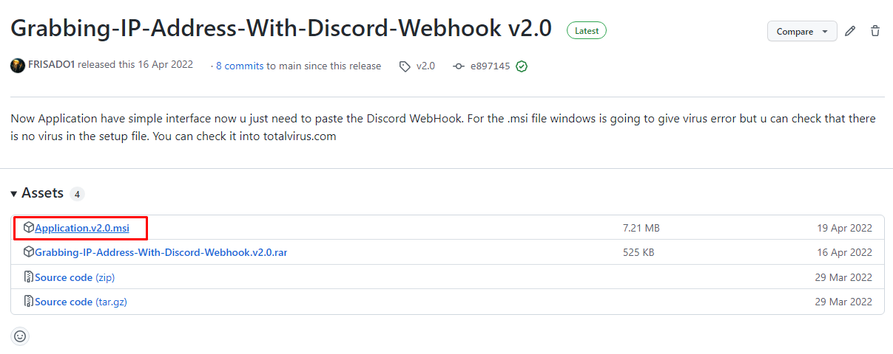
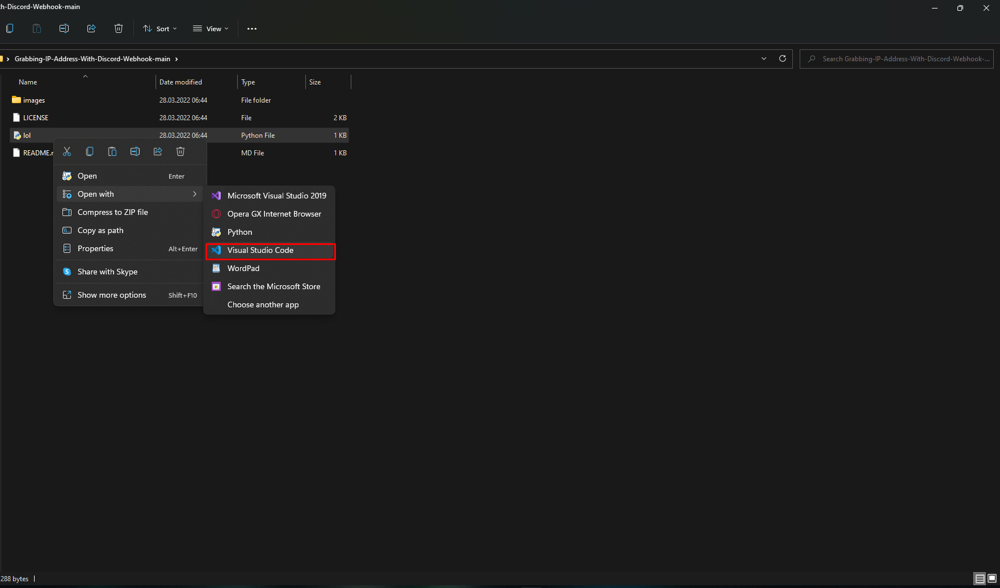
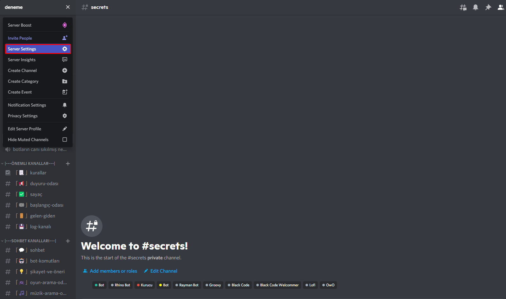
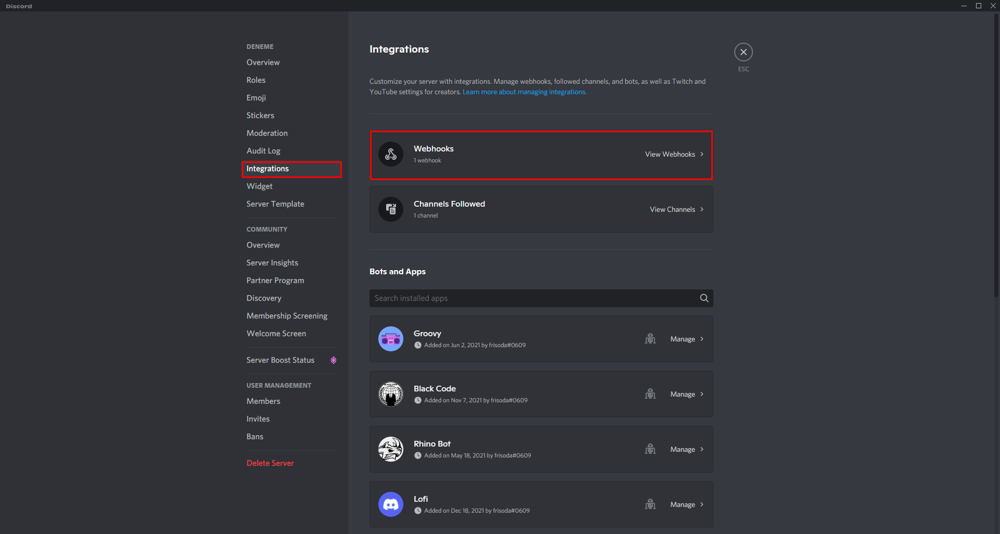
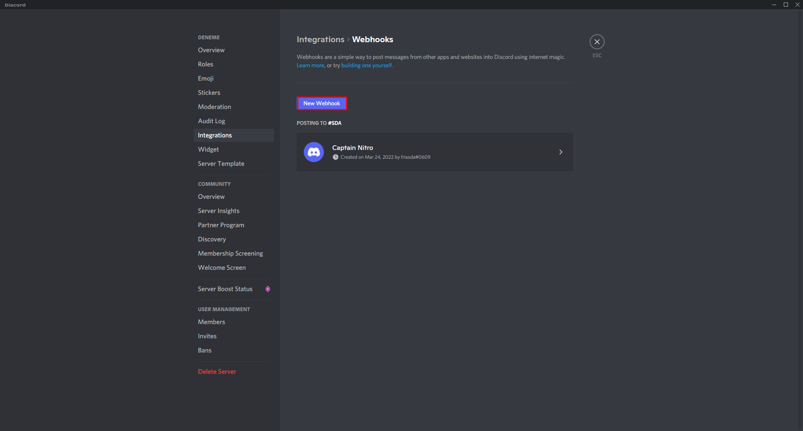
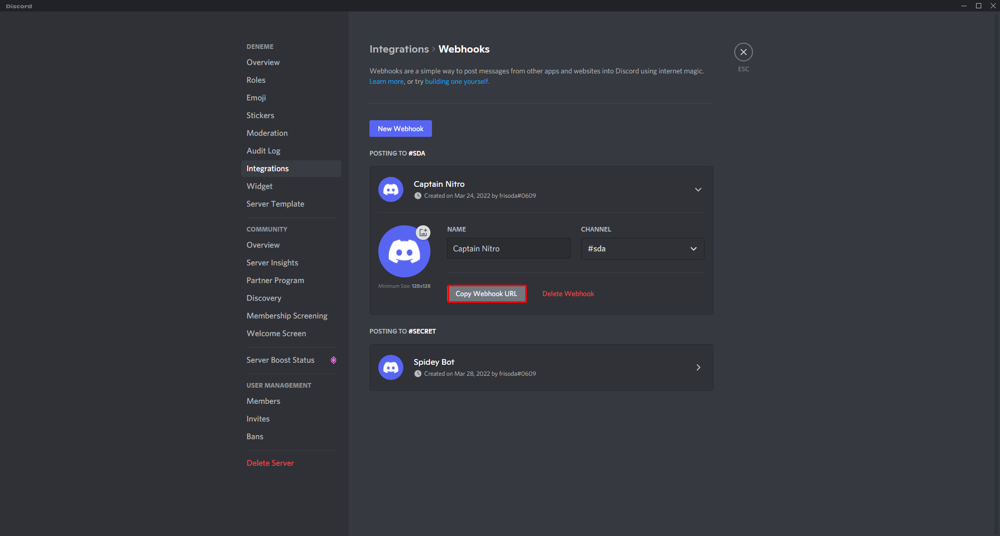

```
https://github.com/FRISADO1
```

## Grabbing-IP-Address-With-Discord-Webhook
This tool made by FRISADO1 you can grab anyone's ip adress with this tool. This is just for educational purpose I don't accept any responsibility.

## LICENSE
GNU GENERAL PUBLIC LICENSE [FRISADO1](https://github.com/FRISADO1/Grabbing-IP-Address-With-Discord-Webhook/blob/main/LICENSE)

<h1>Downloading and Integrations</h1>
Firstly you need to download this file



Then you must open the file Application v1.1.py with [Visual Studio Code](https://code.visualstudio.com)



After that you should change the part called "YOUR DISCORD WEBHOOK TO SEND IP'S TO CHANNEL" to your discord webhook to send ip to your server. Then you will send it to your victim and when your victim opens and presses enter the ip is going to send to your channel.

<h1>How to create a Discord Webhook?</h1>

Firstly you should have a Discord account and a private server that you own. Secondly you should go to the "Server Settings" and next "Integrations".





Then you should go Webhooks in Integrations and create a new Webhook(Last Photo). 



Finally you should copy the link of Discord Webhook and paste it to "YOUR DISCORD WEBHOOK TO SEND IP'S TO CHANNEL".



## Contact With Me

You can message me on Discord to frisoda#0609 or you can mail to frisado1@gmail.com


